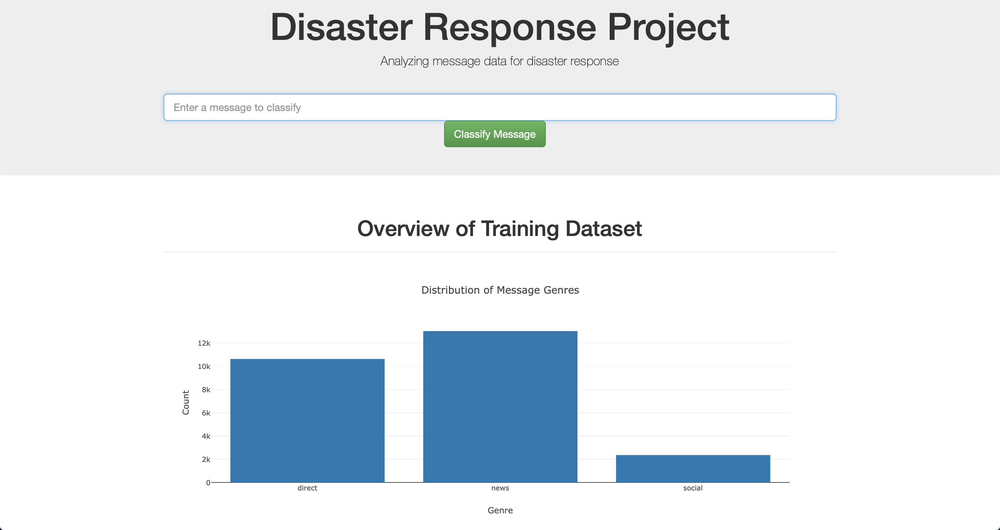
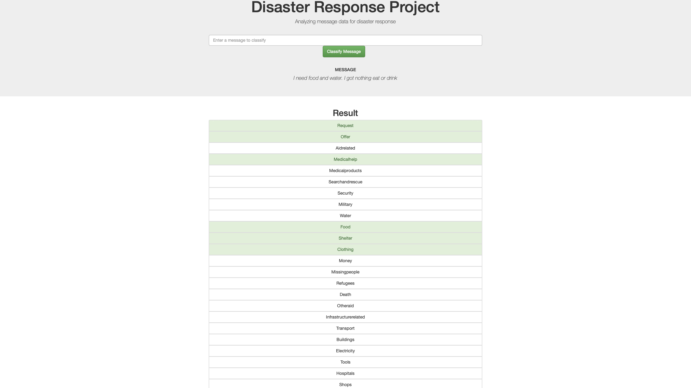

# Disaster_Response

## Project Overview

This repository contains a disaster response app. The app is designed to be used during a disaster. It classifies text data from social media posts, flags it, and directs it to the correct emergency response agency.

## File Descriptions

- **disaster_messages.csv**: Contains text data from social media posts regarding disasters.

- **disaster_categories.csv**: Contains the labels for the text data in disaster_messages.csv

- **process_data.py**: This code cleans and merges (on = 'id') disaster_categories.csv and disaster_messages.csv files. The result is stored in a SQLite database **DisasterResponse.db**
      
- **train_classifier.py**: Contains a Random Forest model to be trained on the data in **DisasterResponse.db**. It outputs a pickled file **classifier.pkl** of the fitted model

- **app**: This folder contains the files needed to render the web app.

## Installation
In the project's root directory, run the following commands:

### ETL pipeline
`python data/process_data.py data/disaster_messages.csv data/disaster_categories.csv data/DisasterResponse.db`
### ML pipeline
`python models/train_classifier.py data/DisasterResponse.db models/classifier.pkl`

### Render the Web App
1. In the app's directory run:
    `python run.py`

2. Go to http://0.0.0.0:3001/

## Warnings
The dataset is highly imbalanced.

## Acknowledgments
The project was done to satisfy the Data Science Nanodegree. It uses data from Figure Eight.

## Licence

MIT License

Copyright (c) [year] [fullname]

Permission is hereby granted, free of charge, to any person obtaining a copy
of this software and associated documentation files (the "Software"), to deal
in the Software without restriction, including without limitation the rights
to use, copy, modify, merge, publish, distribute, sublicense, and/or sell
copies of the Software, and to permit persons to whom the Software is
furnished to do so, subject to the following conditions:

The above copyright notice and this permission notice shall be included in all
copies or substantial portions of the Software.

THE SOFTWARE IS PROVIDED "AS IS", WITHOUT WARRANTY OF ANY KIND, EXPRESS OR
IMPLIED, INCLUDING BUT NOT LIMITED TO THE WARRANTIES OF MERCHANTABILITY,
FITNESS FOR A PARTICULAR PURPOSE AND NONINFRINGEMENT. IN NO EVENT SHALL THE
AUTHORS OR COPYRIGHT HOLDERS BE LIABLE FOR ANY CLAIM, DAMAGES OR OTHER
LIABILITY, WHETHER IN AN ACTION OF CONTRACT, TORT OR OTHERWISE, ARISING FROM,
OUT OF OR IN CONNECTION WITH THE SOFTWARE OR THE USE OR OTHER DEALINGS IN THE
SOFTWARE.

## Screenshots of the Web app

